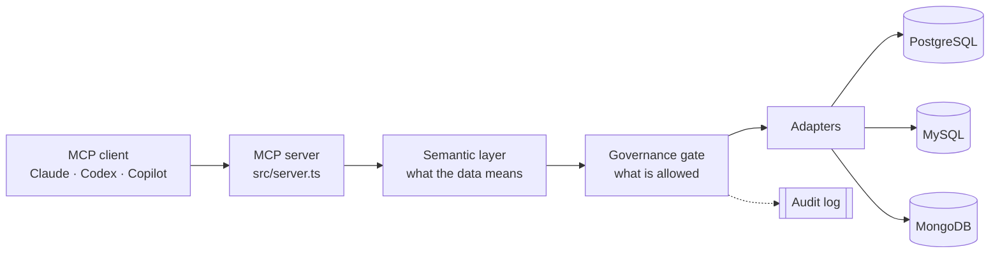
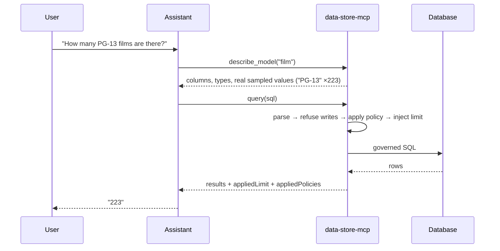

# data-store-mcp

A Model Context Protocol server that gives AI assistants **governed** access to your
databases — described, bounded, and auditable.

Point it at PostgreSQL, MySQL, or MongoDB. Your assistant gets a schema it can read
instead of guess at, and a hard boundary it cannot cross: no writes, no unbounded
result sets, no credentials in the model's context, and per-user row and column rules
it cannot talk its way around.

## Quick start

```bash
npm install && npm run build

node dist/cli/index.js serve \
  --config /abs/path/data-store-mcp.config.json \
  --env-file /abs/path/.env \
  --check
```

`--check` validates the config, connects to every source, then exits — fix problems
here rather than inside a tool call. Drop `--check` to run the server.

Then register it with your assistant. **[CLIENTS.md](CLIENTS.md)** covers Claude Code,
Claude Desktop, Codex CLI, and GitHub Copilot; all four use the same launch command.

| Guide | For |
|---|---|
| [CLIENTS.md](CLIENTS.md) | Wiring it into Claude, Codex, or Copilot |
| [WALKTHROUGH.md](WALKTHROUGH.md) | First run end to end, with real output |
| [EXTENSION.md](EXTENSION.md) | Full config reference · shipping as a VS Code extension |
| [spec.md](spec.md) · [architecture.md](architecture.md) · [test.md](test.md) | Design decisions and how each one is verified |

## The problem it solves

An assistant with a database connection string already "works". Three things go wrong:

1. **It guesses.** It has never seen your schema, so it invents column names. Wrong is
   annoying; *nearly* right is worse — plausible numbers that are quietly incorrect.
2. **Nothing stops it.** `DELETE`, `DROP`, a `SELECT *` on a billion-row table.
3. **It sees everything** the connection can reach, regardless of who is asking.

This server addresses each: a semantic layer so it stops guessing, a governance gate so
it cannot do damage, and per-principal policy so it only sees what that person may see.

## How it works



Every statement is parsed into a syntax tree, rewritten, then executed. Adapters accept
a `QueryPlan` — a type branded with a symbol only the governance module can produce — so
**no code path runs assistant-authored SQL as a string.** Bypassing the gate is a
compile error, not a discouraged practice.



## What it enforces

| | |
|---|---|
| **Read-only** | Writes are refused on the AST, including ones hidden in a CTE or `SELECT … INTO`, and multi-statement payloads |
| **Row limits** | Injected into the query tree; the response reports the limit applied |
| **Timeouts** | Cancelled by the database itself, so the query genuinely stops |
| **Result caps** | Cursors stop as soon as the serialized size crosses the cap, before buffering |
| **Row-level policy** | Predicates injected *after* parsing — appending `OR 1=1` does nothing |
| **Column-level policy** | Hidden columns vanish from `SELECT *`, `describe_model`, errors, and suggestions |
| **Credentials** | Live in config and `.env`; never appear in a tool argument or response |
| **Audit** | One append-only record per execution, including denials and timeouts |

## The six tools

| Tool | Purpose |
|---|---|
| `list_sources` | Which databases exist and what each is for |
| `describe_model` | Columns, types, and **sampled real values** for one model |
| `list_metrics` | Named business measures defined in your semantic model |
| `dry_plan` | Validate SQL — resolve names, apply policy — **without executing** |
| `query` | Run governed, read-only SQL |
| `search_context` | Previously successful queries, labelled as prior art |

`dry_plan` is what turns a hallucinated column into a correction rather than a dead end:

```json
{ "error": { "code": "E_UNKNOWN_COLUMN", "message": "Unknown column: titel",
             "didYouMean": ["title"], "hint": "Did you mean: title?" } }
```

Returned as a tool *result*, not thrown — a protocol error never reaches the model, so
the assistant could not read it and self-correct.

## The semantic layer

`mdl bootstrap` reads your schema *and samples the data* into reviewable YAML:

```yaml
- name: rating
  provenance: introspection
  verified: false
  profile:
    distinctCount: 5
    topValues: [{ value: "PG-13", count: 223 }, { value: "R", count: 195 }]
```

Those sampled values are why the assistant writes `'PG-13'` rather than guessing between
`PG13` and `pg_13`.

`verified: false` is deliberate. A machine-generated description that *looks*
authoritative but is wrong is worse than none, because the assistant will trust it.
Nothing is treated as ground truth until a human reviews it in a pull request.

## CLI

```bash
dsm serve    --config <path> --env-file <path> [--check]
dsm query    --source <name> --sql <sql>
dsm ask      "<question>" --guided|--direct
dsm mdl      bootstrap|lint --source <name>
dsm skills   get <name>
dsm dashboard deploy --file <path> --provider <name>
```

`mdl lint` re-checks the semantic model against the live database and reports drift when
someone drops a column or changes a type. Worth scheduling.

## Configuration

```json
{
  "principal": "local-analyst",
  "sources": [
    { "name": "app", "type": "postgres",
      "description": "Read replica. Orders, customers, invoices.",
      "options": { "host": "127.0.0.1", "port": 5432, "user": "readonly_user",
                   "password": "${DATASTORE_PASSWORD}", "database": "app" } }
  ],
  "semantic": { "path": "/abs/path/semantic" },
  "audit":    { "path": "/abs/path/.data-store-mcp/audit.jsonl" }
}
```

Those four keys are required. The schema rejects unknown keys, so a typo is a startup
error rather than a silent default — and JSON has no comments, so don't add one.

`${VAR}` values come from `--env-file`, keeping secrets out of both the config and your
MCP client's config. `principal` is supplied out-of-band and is **never** an MCP tool
argument: an assistant that could name its own principal would escalate by asking.

Full reference: [EXTENSION.md § Config reference](EXTENSION.md#config-reference).

## Repository layout

```text
src/
├── server.ts            MCP stdio entry point
├── mcp/tools/           the six published tools
├── governance/          parser, read-only guard, limits, RLAC/CLAC, QueryPlan
├── semantic/            MDL schema, registry, join paths, compiler, bootstrap
├── sources/             adapters: postgres, mysql, mongodb (+ mssql, deferred)
├── orchestrator/        guided vs direct prompt assembly
├── memory/              query memory and hybrid retrieval
├── evaluation/          golden query eval runner
├── auth/ audit/         principals and the append-only execution log
├── dashboard/           self-contained dashboard generation and deploy
└── cli/                 the dsm command

extension/               VS Code extension (see EXTENSION.md)
tests/                   unit · integration · e2e · invariant · type-level
```

## Development

```bash
npm run db:up        # Pagila (Postgres) + Sakila (MySQL) + Mongo in Docker
npm run build
npm test             # 619 passing
npm run typecheck    # src and tests
npm run eval:golden  # run queries.yml against the live database
```

Tests run in four layers, each proving something the others cannot: unit for pure logic,
integration against real databases, e2e against the spawned MCP server, and **invariant**
tests that scan the tree for architectural violations — nothing outside `src/governance/`
may mint a `QueryPlan`, and no tool may reach the raw string-SQL path.

## Status and scope

Phases 0–5 complete: foundation, governance, semantic layer, memory and evaluation,
access control, dashboards. 619 tests passing.

**Deliberately not included.** Apache DataFusion — the sources each have a capable
planner, and adopting a Rust engine for three of them isn't justified; DuckDB is the
answer if cross-source joins ever become a requirement. A large connector catalogue —
scope is PostgreSQL, MySQL, MongoDB, with a SQL Server adapter present but unwired and
untested.

**Known gaps.** `instructions.md` isn't shipped, so guided prompts inject `(none)` for
business rules — that is Tier-3 content only a human can write. MySQL exempts `SLEEP()`
from `max_execution_time`, so timeouts there are not a universal wall-clock guarantee
the way Postgres `statement_timeout` is. The VS Code extension has no test suite yet.

## Tech stack

TypeScript · Node 18+ · `@modelcontextprotocol/sdk` · Zod · `node-sql-parser` ·
LanceDB · PostgreSQL / MySQL / MongoDB drivers · Vitest
