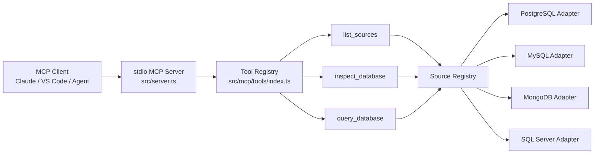
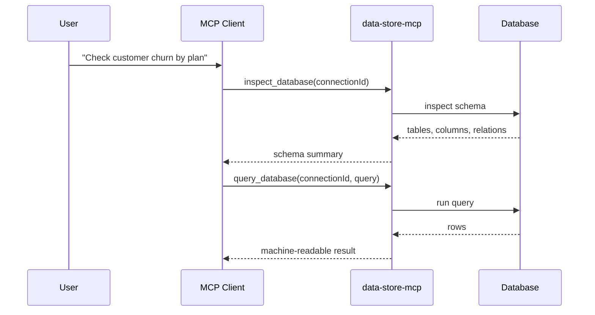

# data-store-mcp

A TypeScript Model Context Protocol (MCP) server that gives AI assistants structured, inspectable access to application data.

`data-store-mcp` sits between an MCP client and one or more administrator-configured databases, exposing safe tool-shaped operations such as list, inspect, and query. Credentials remain in server-side config and never pass through MCP tool arguments.

## Why this project matters

Most AI workflows break the moment an assistant needs live data. This project closes that gap by packaging database access behind a consistent MCP interface.

What it demonstrates:
- MCP server design with a real developer use case
- reusable adapter architecture across SQL and NoSQL backends
- schema-first assistant workflows (`inspect` before `query`)
- typed tool contracts and validation with Zod
- practical AI tooling for internal analytics, debugging, and ops support

## Highlights

- MCP stdio server built with `@modelcontextprotocol/sdk`
- tool registry for list / inspect / query workflows
- validated, config-driven source registry loaded at startup
- backend adapters for PostgreSQL, MySQL, and MongoDB in the active flow
- SQL Server adapter code included for broader multi-database support
- clean repository structure for extending the server with more tools

## Architecture overview



## Typical assistant workflow



## Exposed MCP tools

### `list_sources`
Lists the sources configured by the server administrator.

Used for:
- discovering source names and database types
- selecting a source for later inspect/query calls
- keeping credentials outside the model context

### `inspect_database`
Lets an assistant inspect tables, collections, columns, and relationships before it generates a query.

Used for:
- reducing hallucinated schema references
- mapping unknown databases quickly
- grounding downstream analysis tasks

### `query_database`
Executes SQL queries or structured MongoDB query payloads.

Used for:
- analytics questions
- debugging live application data
- powering internal AI workflows that need trustworthy data access

## Example setup

Install and build:

```bash
npm install
npm run build
```

Start the server:

```bash
export ANALYTICS_DB_PASSWORD='...'
export DATA_STORE_MCP_CONFIG="$PWD/data-store-mcp.config.example.json"
npm start
```

The optional `limits.maxResultBytes` setting caps the exact UTF-8 JSON size of
query results. PostgreSQL, MySQL, and MongoDB cursors are stopped as soon as the
cap is crossed, before the remaining result is buffered in Node.

Because the server runs on stdio, it is typically launched by an MCP client rather than manually used in a shell.

## Example MCP client configuration

```json
{
  "mcpServers": {
    "data-store-mcp": {
      "command": "node",
      "args": ["/absolute/path/to/data-store-mcp/dist/server.js"],
      "env": {
        "DATA_STORE_MCP_CONFIG": "/absolute/path/to/data-store-mcp.config.json",
        "ANALYTICS_DB_PASSWORD": "set-this-in-your-client-secret-store"
      }
    }
  }
}
```

## Example usage flow

1. Create a server-side source config from `data-store-mcp.config.example.json`.
2. Start the MCP client with `DATA_STORE_MCP_CONFIG` set for the server process.
3. Ask the client to list sources and inspect one.
4. Use the returned schema to drive a targeted query.

Example prompt to an assistant:

```text
List the configured sources, inspect the analytics source's customer and subscription tables,
and then show me the number of active customers by pricing plan.
```

## Repository structure

```text
data-store-mcp/
├── src/
│   ├── server.ts
│   ├── database-source.ts
│   ├── postgres.ts
│   ├── mysql.ts
│   ├── mongodb.ts
│   ├── mssql.ts
│   ├── config/
│   │   └── load.ts
│   ├── sources/
│   │   └── registry.ts
│   └── mcp/
│       └── tools/
│           ├── index.ts
│           ├── inspector.ts
│           ├── list-sources.ts
│           └── query.ts
├── test_server_e2e.ts
├── verify_schema.ts
└── package.json
```

## Tech stack

- TypeScript
- Node.js
- Model Context Protocol SDK
- Zod
- PostgreSQL / MySQL / MongoDB / MSSQL drivers

## Good fit for

- AI-native internal tooling
- assistant-enabled data exploration
- database-aware coding agents
- analytics copilots and support workflows

## Status

This is a strong portfolio project for AI tooling and backend platform roles because it shows protocol integration, typed backend design, and practical developer-product thinking in one repo.
