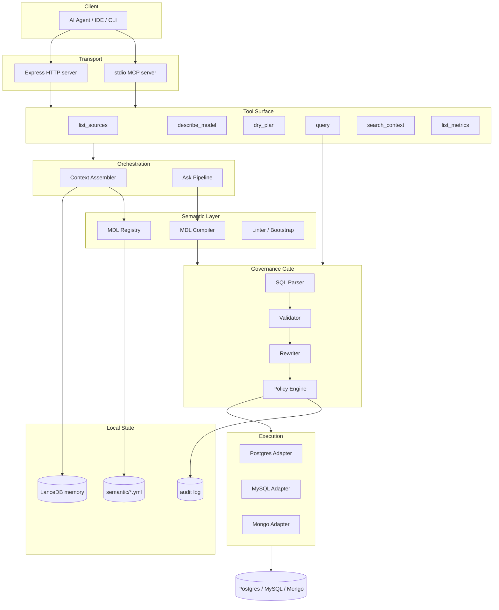
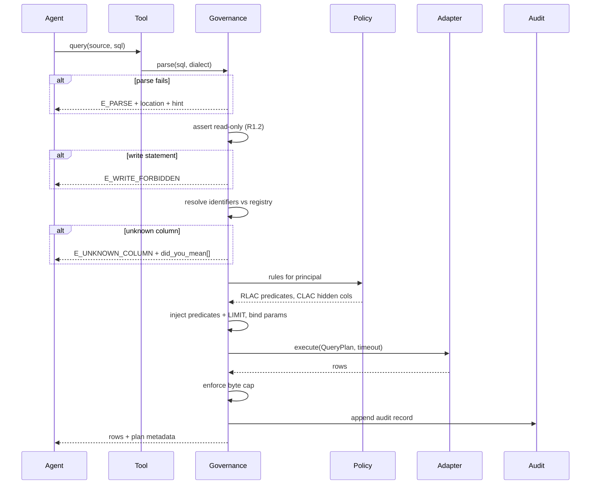
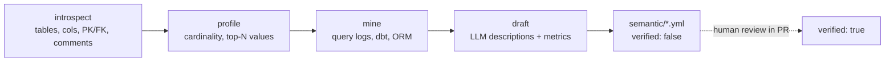

# data-store-mcp — Architecture

> Companion to [spec.md](spec.md) (*what* and *why*) and [plan.md](plan.md) (*when*).
> This document covers *how*: components, boundaries, data flow, and invariants.
>
> **Scope:** PostgreSQL, MySQL, MongoDB. SQL Server is deferred — see §8.

---

## 1. The central idea

Today an agent talks to a database driver almost directly:

```
Agent ──▶ query_database ──▶ Database.query() ──▶ driver ──▶ DB
```

Arbitrary SQL, arbitrary blast radius. The target architecture inserts two layers that
the agent cannot route around:

```
Agent ──▶ tool ──▶ Orchestrator ──▶ Semantic Layer ──▶ Governance Gate ──▶ Adapter ──▶ DB
                                    (what it means)   (what it may do)
```

**The Semantic Layer** answers *what does this mean* — turning modeled business concepts
into correct SQL, so the agent never guesses schema.

**The Governance Gate** answers *what is allowed* — every statement is parsed to an AST,
rewritten (limits, RLAC predicates), and validated before any driver sees it.

Everything else in this document follows from keeping those two layers non-bypassable.

---

## 2. Layers



### 2.1 Transport
Two entry points, one core. `stdio` for local agents (Claude Code, IDEs); Express for
host applications that carry their own user identity. Transport is responsible only for
framing and for supplying the **principal** (§6) — never for policy.

### 2.2 Tool surface
Six tools (spec R6.1). Notably `connect_database` is **removed**: sources come from
config at startup, so credentials never transit the model's context and the agent cannot
open an unmanaged connection.

### 2.3 Orchestration
Assembles context for `ask`: relevant models from the registry, `instructions.md`, and
retrieved precedents from memory. Owns the `--guided` vs `--direct` distinction.

### 2.4 Semantic layer
Loads and validates `semantic/*.yml` into an in-memory registry; compiles metric and
dimension selections into dialect-correct SQL using declared join paths.

### 2.5 Governance gate
The choke point. Parses SQL to an AST, rejects non-read statements, injects limits and
row-level predicates, binds parameters, then hands a *validated plan object* — never a
string — to the adapter.

### 2.6 Execution
Adapters become deliberately dumb: connect, execute a validated plan, introspect,
profile. All policy has already been applied upstream.

---

## 3. Module layout

```
src/
  transport/
    stdio.ts            # MCP stdio server
    http.ts             # Express server
  mcp/tools/            # tool definitions (thin — delegate immediately)
  orchestrator/
    context.ts          # context assembly for ask
    ask.ts              # guided / direct pipeline
  semantic/
    registry.ts         # load + index MDL
    compiler.ts         # MDL selection -> SQL
    joinpath.ts         # relationship graph traversal
    linter.ts           # MDL vs live DB drift
    bootstrap.ts        # introspect + profile + mine -> draft MDL
    types.ts            # Model, Column, Relationship, Metric, Cube
  governance/
    parse.ts            # SQL -> AST (node-sql-parser)
    validate.ts         # read-only, identifier resolution, typecheck
    rewrite.ts          # limit injection, RLAC predicates
    policy.ts           # principal -> RLAC/CLAC rules
    errors.ts           # structured error taxonomy
    mongo.ts            # equivalent gate for Mongo pipelines
  sources/
    types.ts            # Database, ColumnInfo, ColumnProfile, QueryPlan
    postgres.ts
    mysql.ts
    mongodb.ts
    registry.ts         # config -> live adapters (replaces ConnectionManager)
  memory/
    index.ts            # LanceDB hybrid retrieval
  audit/
    log.ts
  config/
    load.ts             # sources, principal, limits from env/file
  cli/
    index.ts            # serve, mdl, ask, query, skills

semantic/               # DATA, not code — Git-tracked MDL
  models/*.yml
  metrics/*.yml
instructions.md         # business rules (spec R4.1)
queries.yml             # approved examples + golden evals (spec R4.2)
```

The split between `src/semantic/` (code) and `semantic/` (data) is deliberate: the YAML
is the reviewable asset, versioned alongside the code that interprets it.

---

## 4. Request flows

### 4.1 `query` — the governed path



Every arrow into the adapter carries a `QueryPlan`, never text. That is what makes the
gate non-bypassable: there is no code path from a tool to a driver that accepts a string.

### 4.2 `dry_plan` — validation without execution

Identical to §4.1 up to the point of dispatch, then stops and returns plan metadata:
resolved tables and columns, applied RLAC predicates, effective row limit, and estimated
cost where `EXPLAIN` is available. This is the anti-hallucination loop — an agent can
iterate to a correct query at zero risk and zero data exposure.

### 4.3 `mdl bootstrap` — model acquisition

Implements spec §5. Four automated stages, then a human gate:



Nothing downstream trusts an unverified entity silently — `dry_plan` warns when a query
depends on one.

---

## 5. Key interfaces

```ts
// sources/types.ts — adapters are dumb executors
interface Database {
  connect(): Promise<void>;
  listTables(): Promise<TableInfo[]>;
  getSchema(table?: string): Promise<ColumnInfo[]>;
  getRelations(database?: string): Promise<TableRelation[]>;
  profile(table: string, columns?: string[]): Promise<ColumnProfile[]>;
  execute(plan: QueryPlan, opts: ExecOpts): Promise<ResultSet>;
  explain?(plan: QueryPlan): Promise<PlanEstimate>;
}

// The only thing an adapter will execute. Constructible solely by the gate.
interface QueryPlan {
  readonly sql: string;              // post-rewrite, parameterized
  readonly params: unknown[];
  readonly dialect: Dialect;
  readonly appliedLimit: number;
  readonly appliedPolicies: string[];
  readonly _brand: unique symbol;    // prevents forging a plan outside governance
}

interface ExecOpts { timeoutMs: number; maxBytes: number; signal: AbortSignal; }

// governance/errors.ts — spec R2.2
interface StructuredError {
  code: 'E_PARSE' | 'E_WRITE_FORBIDDEN' | 'E_UNKNOWN_TABLE' | 'E_UNKNOWN_COLUMN'
      | 'E_TYPE_MISMATCH' | 'E_POLICY_DENIED' | 'E_TIMEOUT' | 'E_RESULT_TOO_LARGE'
      | 'E_UNVERIFIED_MODEL';
  message: string;
  location?: { line: number; column: number };
  hint?: string;
  didYouMean?: string[];
}
```

The branded `QueryPlan` is the mechanism behind the §4.1 invariant: `execute()` accepts
nothing else, and only `governance/rewrite.ts` can produce one. A future contributor
cannot accidentally add a path that runs raw agent SQL.

---

## 6. Cross-cutting concerns

**Principal.** Supplied by transport at startup (env/config for stdio) or per-request by
the host app (Express). Never an MCP tool argument — an agent that can assert its own
role escalates by asking. Flows to `policy.ts` and to every audit record.

**Configuration.** Sources, credentials, limits and principal come from env/config file.
Credentials are referenced by source name and never serialized into a tool response.

**Errors.** One taxonomy (§5), used by both `dry_plan` and `query`. Driver errors are
translated, never passed through raw — a Postgres error string is not actionable to an
agent, and can leak schema detail past CLAC.

**Audit.** Append-only record per execution: principal, source, question, compiled SQL,
applied policies, row count, duration, outcome.

**MongoDB.** Not modeled in MDL initially (spec D2). It bypasses the *compiler* but not
the *gate* — `governance/mongo.ts` enforces read-only operations, a forced `$limit`, and
a pipeline-stage cap.

---

## 7. Invariants

These are the properties that must survive refactoring. Each is worth a test.

1. **No path from a tool to a driver accepts a string.** Only `QueryPlan`.
2. **Only `governance/` constructs a `QueryPlan`.**
3. **RLAC predicates are injected after parsing the agent's SQL**, so no agent-authored
   text can remove them.
4. **CLAC-hidden columns never appear in `describe_model`.** An agent cannot request
   what it was never shown.
5. **Credentials never appear in a tool argument or a tool response.**
6. **Every execution writes exactly one audit record**, including failures.
7. **Unverified MDL entities are usable but always announced.**

---

## 8. Deferred and out of scope

| Item | Status | Rationale |
|---|---|---|
| SQL Server | **Deferred** | Descoped for now. `src/mssql.ts` stays in the tree, unwired; it is not a Phase 0 task. Reduces Phase 2 to two SQL dialects. |
| Apache DataFusion | Rejected | Rust toolchain for four sources that each have a planner (spec D1). Revisit as DuckDB if cross-source joins become real. |
| 22+ connectors | Out of scope | Three sources is the target. |
| WASM / browser execution | Deferred | Depends on revisiting D1. |
| Python SDK | Deferred | No consumer yet (spec R6.5). |

---

## 9. Consequences of this design

**What it buys.** A single choke point means governance is provable rather than
aspirational; the branded plan type makes bypass a compile error. Dumb adapters keep
per-source cost low, which matters if a fourth source is added later. MDL-as-files means
the semantic model reviews like code.

**What it costs.** Two SQL dialects must be handled explicitly in the compiler with no
DataFusion layer to normalize them. Parsing every statement adds latency (small,
sub-millisecond for typical queries, but non-zero). And the MDL only stays accurate if
someone maintains it — `mdl lint` (spec R3.5) detects drift but cannot fix it.

**Biggest risk.** The semantic layer is only as good as its Tier 3 content, which no
amount of engineering produces (spec §5.3). If nobody reviews bootstrapped MDL, the
system degrades into a slower version of what exists today.
